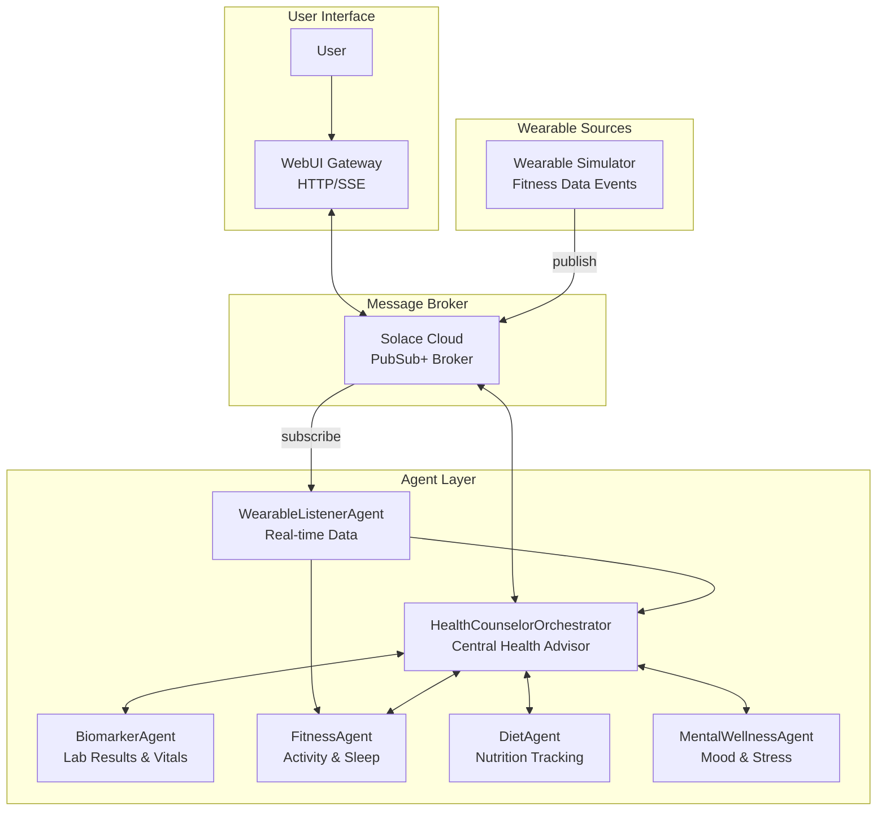

# Solace Agent Mesh Demo

**Health Counselor Assistant** - A multi-agent AI system using Solace's event mesh for personalized health guidance and wellness management.

## Overview

This demo showcases Solace Agent Mesh (SAM), a framework for building multi-agent AI systems that communicate through Solace's event-driven messaging infrastructure. The application implements a **Health Counselor Assistant** that helps individuals optimize their wellbeing through:

- Natural language queries about biomarkers, fitness, nutrition, and mental wellness
- Intelligent orchestration across multiple specialized health agents
- Real-time coordination via Solace message broker
- **Real-time wearable data streaming** with simulated fitness device updates via Solace Cloud

## Features

- **Multi-Agent Health Orchestration**: Central counselor coordinates specialized agents for holistic health analysis
- **Biomarker Tracking**: Monitor lab results, blood tests, and vital signs with reference range analysis
- **Fitness Monitoring**: Track activity, sleep, heart rate, and workouts from wearable devices
- **Nutrition Analysis**: Log meals and analyze macronutrients, calories, and dietary patterns
- **Mental Wellness Tracking**: Self-reported mood, stress levels, and journaling support
- **Real-Time Wearable Streaming**: Receive and react to live fitness data via Solace event mesh

## Architecture



### Communication Flow

1. User sends a natural language health query via the WebUI
2. WebUI Gateway forwards the request through the Solace Broker
3. HealthCounselorOrchestrator analyzes the request and determines which agents to query
4. Specialized agents query their data sources and return health insights
5. Orchestrator correlates findings and generates personalized recommendations
6. Response is streamed back to the user via SSE

## Agents

| Agent | Purpose | Data Source |
|-------|---------|-------------|
| **HealthCounselorOrchestrator** | Central coordinator - analyzes requests, routes to appropriate agents, provides holistic health guidance | N/A |
| **WearableListenerAgent** | Subscribes to real-time wearable data, coordinates database updates and alerts | Solace event topics |
| **BiomarkerAgent** | Lab results, blood tests, vital signs, and reference range analysis | `biomarker.db` |
| **FitnessAgent** | Activity tracking, sleep data, heart rate, workouts from wearables | `fitness.db` |
| **DietAgent** | Meal logging, calorie tracking, macronutrient analysis | `diet.db` |
| **MentalWellnessAgent** | Self-reported mood, stress levels, energy, journaling | `mental_wellness.db` |

## Prerequisites

- **Python 3.10+**
- **Solace Cloud Account** - Free tier available at [solace.com](https://solace.com) (or local Docker container)
- **OpenAI API Key** - Or compatible LLM endpoint (Azure OpenAI, etc.)

## Solace Cloud Setup

The demo uses Solace Cloud for event-driven messaging between agents. Follow these steps to set up your free Solace Cloud account:

### 1. Create a Solace Cloud Account

1. Go to [https://solace.com](https://solace.com) and click **"Start Free"**
2. Create an account and verify your email
3. Log in to the [Solace Cloud Console](https://console.solace.cloud)

### 2. Create a Messaging Service

1. In the Cloud Console, click **"Cluster Manager"** in the left navigation
2. Click **"Create Service"**
3. Select **"Developer"** tier (free, suitable for development/testing)
4. Choose a cloud provider and region (any will work)
5. Give your service a name (e.g., "health-counselor-demo")
6. Click **"Create Service"** and wait for provisioning (~2 minutes)

### 3. Get Connection Credentials

1. Click on your newly created service
2. Go to the **"Connect"** tab
3. Expand the **"Solace Messaging"** section
4. Note down the following values:
   - **Host** (e.g., `mr-connection-xxxxx.messaging.solace.cloud`)
   - **Message VPN** (e.g., `your-service-name`)
   - **Username** (e.g., `solace-cloud-client`)
   - **Password** (click "Show Password" to reveal)

### 4. Update Your `.env` File

Update the Solace broker settings in your `.env` file:

```env
# Solace Cloud Connection
SOLACE_BROKER_URL=wss://mr-connection-xxxxx.messaging.solace.cloud:443
SOLACE_BROKER_VPN=your-service-name
SOLACE_BROKER_USERNAME=solace-cloud-client
SOLACE_BROKER_PASSWORD=your-password-here
```

> **Note:** Use `wss://` (WebSocket Secure) with port `443` for Solace Cloud. The local Docker broker uses `ws://` with port `8008`.

## Quick Start

### 1. Clone and Setup Environment

```bash
git clone <repository-url>
cd health-counselor-demo

# Create and activate virtual environment
python -m venv venv
source venv/bin/activate  # On Windows: venv\Scripts\activate

# Install dependencies
pip install -r requirements.txt
```

### 2. Install SAM Plugins

```bash
sam plugin install sam-sql-database      # SQL database support for agents
```

### 3. Configure Environment

Create a `.env` file in the project root:

```env
# LLM Configuration
LLM_SERVICE_ENDPOINT=https://api.openai.com/v1
LLM_SERVICE_API_KEY=sk-your-api-key-here
LLM_SERVICE_PLANNING_MODEL_NAME=openai/gpt-4o-mini
LLM_SERVICE_GENERAL_MODEL_NAME=openai/gpt-4o-mini

# Solace Broker Connection
SOLACE_BROKER_URL=ws://localhost:8008
SOLACE_BROKER_USERNAME=default
SOLACE_BROKER_PASSWORD=default
SOLACE_BROKER_VPN=default

# Agent Namespace
NAMESPACE=health/

# WebUI Gateway
FASTAPI_HOST=127.0.0.1
FASTAPI_PORT=8000
SESSION_SECRET_KEY=your-secret-key-here

# Data Path (absolute path to project)
DATA_PATH=/path/to/health-counselor-demo
```

### 4. Start Solace Broker (if running locally)

```bash
docker run -d -p 8008:8008 -p 8080:8080 \
  --name solace \
  solace/solace-pubsub-standard:latest
```

### 5. Start the Agents

Open separate terminal windows for each component:

```bash
# Terminal 1: Health Counselor Orchestrator (start first)
source venv/bin/activate
sam run configs/agents/health-orchestrator.yaml

# Terminal 2: Biomarker Agent
source venv/bin/activate
sam run configs/agents/biomarker-agent.yaml

# Terminal 3: Fitness Agent
source venv/bin/activate
sam run configs/agents/fitness-agent.yaml

# Terminal 4: Diet Agent
source venv/bin/activate
sam run configs/agents/diet-agent.yaml

# Terminal 5: Mental Wellness Agent
source venv/bin/activate
sam run configs/agents/mental-wellness-agent.yaml

# Terminal 6: Wearable Listener Agent (for real-time data)
source venv/bin/activate
sam run configs/agents/wearable-listener-agent.yaml

# Terminal 7: WebUI Gateway (start last)
source venv/bin/activate
sam run configs/gateways/webui.yaml
```

### 6. Access the Application

Open your browser and navigate to: **http://localhost:8000**

## Usage Examples

### Biomarker Queries

```
"What are my latest cholesterol levels?"
"Show me biomarkers that are outside the normal range"
"How has my vitamin D changed over the past 6 months?"
"What blood tests should I be concerned about?"
```

### Fitness Queries

```
"How many steps have I averaged this week?"
"Show me my sleep patterns for the past month"
"What's my resting heart rate trend?"
"How many active minutes did I get yesterday?"
```

### Diet Queries

```
"What did I eat yesterday?"
"Am I meeting my protein goals this week?"
"Show me my calorie intake trends"
"Which meals were highest in sodium?"
```

### Mental Wellness Queries

```
"How has my mood been trending?"
"What days did I report high stress?"
"Show me my energy levels this week"
"When was my last journal entry?"
```

### Multi-Agent Health Analysis

```
"How is my overall health trending this month?"
"What might be affecting my sleep quality?"
"Create a wellness summary for the past week"
"Is there a correlation between my exercise and mood?"
"What should I focus on to improve my energy levels?"
```

## Real-Time Wearable Streaming

The demo includes a wearable streaming system that simulates fitness device data and enables agents to react in real-time.

### Wearable Simulator

The wearable simulator (`scripts/wearable_simulator.py`) publishes fitness data to Solace Cloud:

```bash
# Activate virtual environment
source venv/bin/activate

# Send a single heart rate reading
python scripts/wearable_simulator.py --once --type heart_rate --value 72

# Random fitness data every 10 seconds
python scripts/wearable_simulator.py --scenario random --interval 10

# Workout simulation (elevated heart rate, calories burned)
python scripts/wearable_simulator.py --scenario workout --duration 30

# Sleep tracking simulation
python scripts/wearable_simulator.py --scenario sleep --duration 480

# Stress alert scenario (high HRV indicators)
python scripts/wearable_simulator.py --scenario stress --interval 5
```

### Wearable Listener Agent

The WearableListenerAgent subscribes to wearable data topics and:
1. Receives real-time data from the Solace event mesh
2. Updates the fitness database with new readings
3. Sends proactive alerts for abnormal values (e.g., high heart rate)

Start the Wearable Listener Agent:

```bash
sam run configs/agents/wearable-listener-agent.yaml
```

### Event Topics

Wearable data is published to topics following this structure:

```
health/events/wearable/{data_type}/update
```

Examples:
- `health/events/wearable/heart_rate/update`
- `health/events/wearable/steps/update`
- `health/events/wearable/sleep/update`

### Event Message Format

```json
{
  "event_id": "WRB-A1B2C3D4",
  "event_type": "wearable_data",
  "data_type": "heart_rate",
  "timestamp": "2024-12-03T15:30:00Z",
  "value": 72,
  "unit": "bpm",
  "source_device": "smartwatch",
  "alert_level": "normal",
  "message": "Heart rate reading: 72 bpm"
}
```

## Data Model

### Biomarker Data (`biomarker_data.csv`)

| Column | Description | Example Values |
|--------|-------------|----------------|
| `test_id` | Unique identifier | BIO-001, BIO-002 |
| `test_date` | Date of test | 2024-10-15 |
| `test_type` | Category of test | blood_panel, metabolic, vitamin |
| `biomarker_name` | Name of biomarker | Glucose, LDL Cholesterol |
| `value` | Measured value | 95, 120 |
| `unit` | Unit of measurement | mg/dL, ng/mL |
| `reference_range_low` | Normal range minimum | 70, 0 |
| `reference_range_high` | Normal range maximum | 100, 100 |
| `status` | Result status | normal, low, high, critical |
| `lab_source` | Testing facility | LabCorp, Quest |
| `notes` | Additional notes | Fasting sample |

### Fitness Data (`fitness_data.csv`)

| Column | Description | Example Values |
|--------|-------------|----------------|
| `record_id` | Unique identifier | FIT-001, FIT-002 |
| `date` | Record date | 2024-12-01 |
| `data_source` | Device source | Apple Watch, Fitbit, Garmin |
| `steps` | Daily step count | 8500 |
| `distance_km` | Distance traveled | 6.2 |
| `active_minutes` | Active exercise minutes | 45 |
| `calories_burned` | Total calories | 2200 |
| `resting_heart_rate` | Resting HR (bpm) | 62 |
| `avg_heart_rate` | Average HR (bpm) | 75 |
| `sleep_hours` | Sleep duration | 7.5 |
| `sleep_quality_score` | Sleep quality (1-100) | 85 |
| `workout_type` | Exercise type | running, cycling, strength |
| `workout_duration_min` | Workout length | 45 |

### Diet Logs (`diet_logs.csv`)

| Column | Description | Example Values |
|--------|-------------|----------------|
| `meal_id` | Unique identifier | MEAL-001, MEAL-002 |
| `date` | Meal date | 2024-12-01 |
| `meal_type` | Type of meal | breakfast, lunch, dinner, snack |
| `food_items` | Foods consumed | Oatmeal with berries |
| `calories` | Total calories | 350 |
| `protein_g` | Protein grams | 12 |
| `carbs_g` | Carbohydrate grams | 55 |
| `fat_g` | Fat grams | 8 |
| `fiber_g` | Fiber grams | 6 |
| `sodium_mg` | Sodium milligrams | 150 |
| `sugar_g` | Sugar grams | 12 |
| `water_ml` | Water intake | 500 |
| `notes` | Additional notes | Pre-workout meal |

### Mental Wellness (`mental_wellness.csv`)

| Column | Description | Example Values |
|--------|-------------|----------------|
| `entry_id` | Unique identifier | MW-001, MW-002 |
| `date` | Entry date | 2024-12-01 |
| `time_of_day` | Time period | morning, afternoon, evening |
| `mood_score` | Mood rating (1-10) | 7 |
| `energy_level` | Energy rating (1-10) | 6 |
| `stress_level` | Stress rating (1-10) | 4 |
| `anxiety_level` | Anxiety rating (1-10) | 3 |
| `sleep_quality_rating` | Sleep quality (1-10) | 8 |
| `activities` | Day's activities | work, exercise, socializing |
| `social_interaction` | Social contact level | high, medium, low, none |
| `journal_entry` | Free-form notes | Felt productive today |
| `gratitude_notes` | Gratitude journaling | Grateful for good weather |
| `tags` | Categorization tags | productive, relaxed, anxious |

## Project Structure

```
health-counselor-demo/
├── configs/
│   ├── shared_config.yaml          # Shared broker, model, and service configs
│   ├── logging_config.yaml         # Logging configuration
│   ├── agents/
│   │   ├── health-orchestrator.yaml    # Central health counselor agent
│   │   ├── wearable-listener-agent.yaml # Real-time wearable subscriber
│   │   ├── biomarker-agent.yaml        # Lab results agent
│   │   ├── fitness-agent.yaml          # Activity/sleep agent
│   │   ├── diet-agent.yaml             # Nutrition agent
│   │   └── mental-wellness-agent.yaml  # Mental health agent
│   └── gateways/
│       └── webui.yaml              # HTTP/SSE web interface gateway
├── scripts/
│   └── wearable_simulator.py       # Wearable data event simulator
├── src/
│   └── wearable_listener/          # Wearable listener lifecycle and tools
│       ├── lifecycle.py            # Solace subscription management
│       └── tools.py                # Data processing tools
├── CSV_Data/
│   ├── biomarker_data.csv          # Lab results source data
│   ├── fitness_data.csv            # Activity/sleep source data
│   ├── diet_logs.csv               # Nutrition source data
│   └── mental_wellness.csv         # Mental health source data
├── *.db                            # SQLite databases (biomarker.db, fitness.db, etc.)
├── requirements.txt                # Python dependencies
├── .env                            # Environment configuration
└── README.md                       # This file
```

## Configuration Reference

### Shared Configuration (`configs/shared_config.yaml`)

The shared config uses YAML anchors to define reusable settings:

- **Broker Connection**: WebSocket URL, credentials, VPN name
- **LLM Models**: Planning model (orchestration) and general model (agents)
- **Services**: Session management, artifact storage, data tools

### Agent Configuration

Each agent config includes:

- **broker**: Connection settings (references shared_config)
- **model**: LLM model to use
- **instruction**: System prompt defining agent behavior
- **tools**: Available tools (SQL queries, file operations, etc.)
- **agent_card**: Description and skills for agent discovery
- **inter_agent_communication**: Allow/deny lists for agent-to-agent calls

## Customization

### Adding a New Health Agent

1. Create a new YAML config in `configs/agents/`:

```yaml
---
name: my-health-agent
agents:
  - name: MyHealthAgent
    broker: *default_broker  # Reference shared config
    model: *general_model
    instruction: |
      You are a specialized health agent for [purpose].
      Your capabilities include...
    tools:
      - name: builtin-group:data_analysis
    agent_card:
      description: "Agent for [health domain]"
      skills:
        - name: health-skill
          description: "What this agent can analyze"
```

2. Start the agent:

```bash
sam run configs/agents/my-health-agent.yaml
```

3. The orchestrator will automatically discover the new agent via its agent card.

### Modifying Agent Instructions

Edit the `instruction` field in the agent's YAML config to change its behavior, analysis capabilities, or response style.

### Connecting to Different Data Sources

Agents using `sam-sql-database` plugin can be configured to:

- Load different CSV files
- Connect to external databases (PostgreSQL, MySQL, etc.)
- Use different data initialization scripts

## Privacy & Security Considerations

This demo handles sensitive health information. In a production environment:

- Implement proper authentication and authorization
- Encrypt data at rest and in transit
- Follow HIPAA/GDPR compliance requirements
- Use secure credential management
- Implement audit logging for data access
- Consider data anonymization for analytics

## Troubleshooting

### Agents not discovering each other

- Ensure all agents are using the same `NAMESPACE` value
- Check that the Solace broker is accessible
- Verify `discovery_publish.enabled: true` in orchestrator config

### Database initialization errors

- Verify `DATA_PATH` environment variable is set correctly
- Check CSV files exist and have correct format
- Look for initialization errors in agent startup logs

### WebUI not loading

- Ensure gateway is started after agents
- Check `FASTAPI_HOST` and `FASTAPI_PORT` settings
- Verify no other service is using port 8000

### Wearable data not streaming

- Check WearableListenerAgent is running and subscribed
- Verify Solace broker connection in simulator
- Check topic patterns match between publisher and subscriber

## License

[Add license information]

## Contributing

[Add contribution guidelines]
