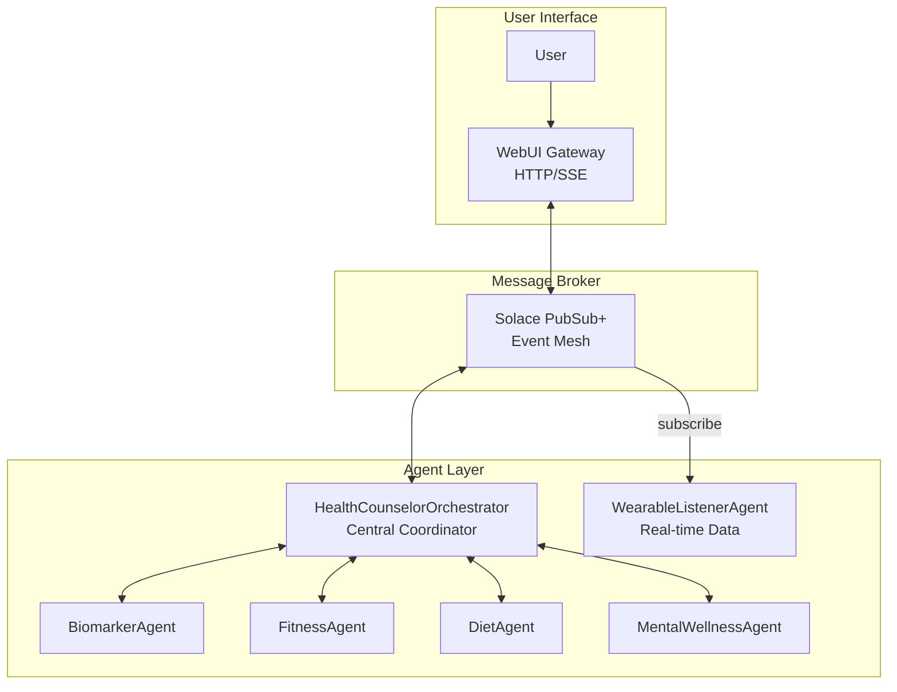

# Solace Agent Mesh Demo

**Health Counselor Assistant** - A multi-agent AI system using Solace's event mesh for personalized health guidance.

## Quick Links

- [Dashboard Guide](docs/DASHBOARD.md) - Web dashboard setup and API reference
- [Wearable Simulation](docs/simulation-demo.md) - Real-time streaming demo walkthrough
- [Data Model](docs/data-model.md) - Database schemas and data formats
- [Configuration](docs/configuration.md) - Environment variables and Solace setup
- [Development](docs/development.md) - Adding agents and customization

## Overview

This demo showcases [Solace Agent Mesh (SAM)](https://github.com/SolaceLabs/solace-agent-mesh), a framework for building multi-agent AI systems that communicate through Solace's event-driven messaging infrastructure.

**Features:**
- Multi-agent health orchestration with specialized domain agents
- Biomarker tracking with lab results and reference ranges
- Fitness monitoring from wearable devices
- Nutrition analysis and meal logging
- Mental wellness tracking with mood and stress patterns
- Real-time wearable data streaming via Solace event mesh
- Interactive web dashboard with health visualizations

## Architecture



## Agents

| Agent | Purpose | Data Source |
|-------|---------|-------------|
| **HealthCounselorOrchestrator** | Coordinates specialized agents for holistic health analysis | N/A |
| **BiomarkerAgent** | Lab results, blood tests, vital signs | `biomarker.db` |
| **FitnessAgent** | Activity, sleep, heart rate, workouts | `fitness.db` |
| **DietAgent** | Meal logging, nutrition analysis | `diet.db` |
| **MentalWellnessAgent** | Mood, stress, energy, journaling | `mental_wellness.db` |
| **WearableListenerAgent** | Real-time wearable data streaming | Solace topics |

## Prerequisites

- **Python 3.10+**
- **Solace Cloud Account** - Free tier at [solace.com](https://solace.com) (or local Docker)
- **OpenAI API Key** - Or compatible LLM endpoint

## Quick Start

### 1. Setup

```bash
git clone <repository-url>
cd health-counselor-demo

python -m venv venv
source venv/bin/activate  # Windows: venv\Scripts\activate
pip install -r requirements.txt

sam plugin install sam-sql-database
```

### 2. Configure

Create `.env` file (see [Configuration](docs/configuration.md) for details):

```env
LLM_SERVICE_ENDPOINT=https://api.openai.com/v1
LLM_SERVICE_API_KEY=sk-your-key
LLM_SERVICE_PLANNING_MODEL_NAME=openai/gpt-4o-mini
LLM_SERVICE_GENERAL_MODEL_NAME=openai/gpt-4o-mini

SOLACE_BROKER_URL=wss://your-broker.messaging.solace.cloud:443
SOLACE_BROKER_VPN=your-vpn
SOLACE_BROKER_USERNAME=solace-cloud-client
SOLACE_BROKER_PASSWORD=your-password

NAMESPACE=health/
DATA_PATH=/path/to/health-counselor-demo
FASTAPI_HOST=127.0.0.1
FASTAPI_PORT=8000
```

### 3. Start Agents

```bash
# Terminal 1: Orchestrator
sam run configs/agents/health-orchestrator.yaml

# Terminal 2: Health Agents
sam run configs/agents/biomarker-agent.yaml
sam run configs/agents/fitness-agent.yaml
sam run configs/agents/diet-agent.yaml
sam run configs/agents/mental-wellness-agent.yaml

# Terminal 3: Wearable Listener (optional)
sam run configs/agents/wearable-listener-agent.yaml

# Terminal 4: WebUI Gateway
sam run configs/gateways/webui.yaml
```

### 4. Access

Open **http://localhost:8000** in your browser.

### 5. Run Evaluations (Optional)

With agents running, you can sanity-check demo flows. First install the Agent Mesh CLI in your venv:

```bash
source venv/bin/activate
pip install solace-agent-mesh
# Required for sam eval
pip install "sam-rest-gateway @ git+https://github.com/SolaceLabs/solace-agent-mesh-core-plugins#subdirectory=sam-rest-gateway"
sam eval configs/evaluations/demo-scenarios.json
```

- Scenario 3 (current heart rate) expects the wearable listener plus the simulator: `python scripts/wearable_simulator.py --scenario workout --duration 60`.

## Dashboard

The demo includes a React dashboard for visualizing health metrics. See [Dashboard Guide](docs/DASHBOARD.md).

```bash
# Backend API (Terminal 1)
DATA_PATH="$(pwd)" uvicorn server.dashboard_api.main:app --port 8082

# Frontend (Terminal 2)
cd client/dashboard && npm install && npm run dev
```

Dashboard: http://localhost:3000 | API Docs: http://localhost:8082/docs

## Usage Examples

```
"What are my latest cholesterol levels?"
"How many steps have I averaged this week?"
"Am I meeting my protein goals?"
"How has my mood been trending?"
"What might be affecting my sleep quality?"
"Give me a comprehensive health summary"
```

## Wearable Streaming

Simulate real-time fitness data:

```bash
# Random data stream
python scripts/wearable_simulator.py --scenario random --interval 10

# Workout simulation
python scripts/wearable_simulator.py --scenario workout --workout-type running
```

See [Wearable Simulation Guide](docs/simulation-demo.md) for all scenarios.

## Troubleshooting

**Agents not discovering each other?**
- Ensure all agents use the same `NAMESPACE` value
- Check broker connectivity

**Database errors?**
- Verify `DATA_PATH` points to project root
- Ensure CSV files exist in `CSV_Data/`

**WebUI not loading?**
- Start gateway after agents are running
- Check `FASTAPI_PORT` is available

**Seeing "Missing critical info ... target_status_topic" in orchestrator logs?**
- Restart the WebUI Gateway and orchestrator after updating configs; the gateway now publishes a status topic via `WEBUI_STATUS_TOPIC` to avoid those warnings.

See [Configuration](docs/configuration.md) for detailed setup help.

## License

This project is licensed under the Apache License 2.0 - see the [LICENSE](LICENSE) file for details.

## Contributing

Contributions are welcome! Please:

1. Fork the repository
2. Create a feature branch (`git checkout -b feature/amazing-feature`)
3. Commit your changes
4. Push to the branch
5. Open a Pull Request
